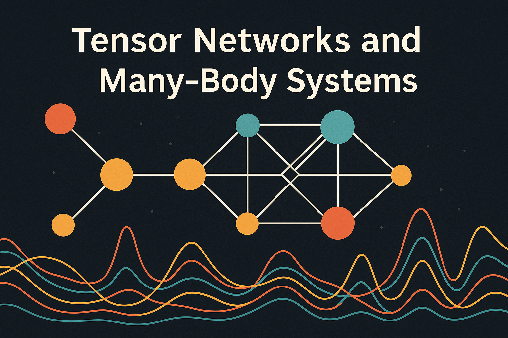

  
In my papers, I use **"Ohyama"** instead of "Oyama".

## Main Interests

A. [Many-body systems](pages/Many-body_systems.md)  
B. [Tensor network representations](pages/Tensor_network_representations.md)

[hoge](pages/hoge.md)

## Links

[google scholar](https://scholar.google.co.jp/citations?user=Z-Ex2ZMAAAAJ&hl=en)  

[Inspire](https://inspirehep.net/authors/2090932)

[Github](https://github.com/shuphys119?tab=repositories)

## Contact
Email: shuhei.oyama@@univie.ac.at

